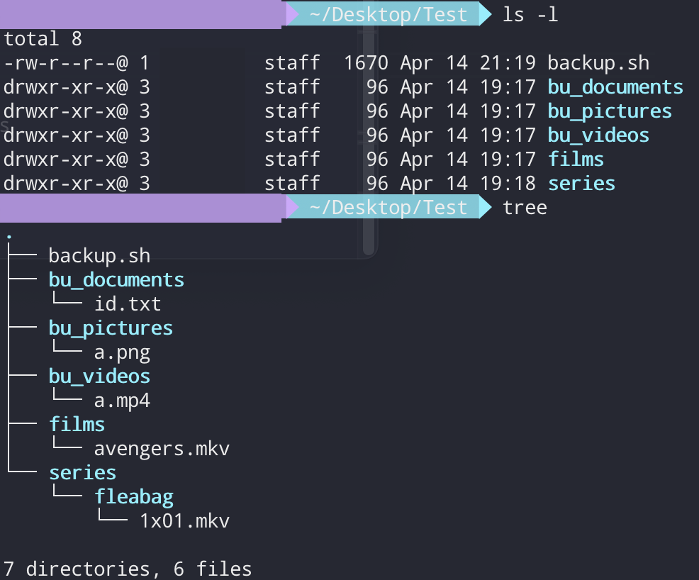
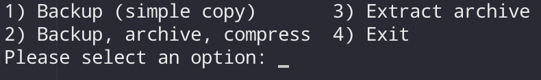

# Backup Script

Bash script that allows easy backup of directories starting with "_bu__".

You can easily differentiate the data you want backed up (ex: pictures) from the data you don't (ex: movies) : just add "_bu__" at the start of the directory's name.

Example : here, only "_bu_documents_", "_bu_pictures_" and "_bu_videos_" (data not retrievable from the internet) will be backed up not "_films_" nor "_series_" (data that can be downloaded again).

---
### Instructions

"_backup.sh_" has to be in the directory that contains the directories you want backed up and make sure to `ls` to the directory.

`sh backup.sh` **or** `chmod +x backup.sh && ./backup.sh`.

---
### Simple menu :

- **Backup (simple copy)** : copies all the directories starting with "_bu__" to the path provided
- **Backup, archive, compress** : archives and compress (tar.gz) all the directories starting with "_bu__" to the path provided
- **Extract archives** : extracts all the compressed archives (tar.gz) in the current directory.
- **Exit** : exits the script

**Backup, archive, compress** will also copy the backup script to the path provided to easily extract the archives when needed.